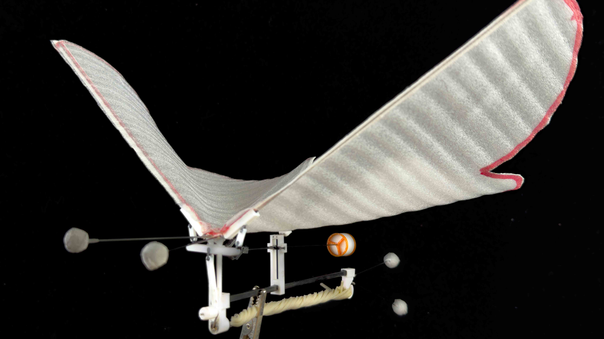

# Overview

This project contains the models, data, and computation code used in our paper.

>**Abstract of our paper**
>
>This paper presents the design, modeling, and experimental validation of a biomimetic robotic butterfly (BRB) that integrates a compliant mechanism to achieve coupled wing-abdomen motion. Drawing inspiration from the natural flight dynamics of butterflies, a theoretical model is developed to investigate the impact of abdominal undulation on flight performance. To validate the model, motion capture experiments are conducted on three configurations: a BRB without an abdomen, with a fixed abdomen, and with an undulating abdomen. The results demonstrate that abdominal undulation enhances lift generation, extends flight duration, and stabilizes pitch oscillations, thereby improving overall flight performance. These findings underscore the significance of wing-abdomen interaction in flapping-wing aerial vehicles (FWAVs) and lay the groundwork for future advancements in energy-efficient biomimetic flight designs.

## Directory Structure

- `BRB-SW/`: Contains the project's 3D models.
- `code/`: Contains the project's data and code.
- `media/`: Contains images and videos.

## Data and Code

The `code` folder contains the code for processing and analyzing the data. Key files data.

## License

This project is licensed under the GNU General Public License.